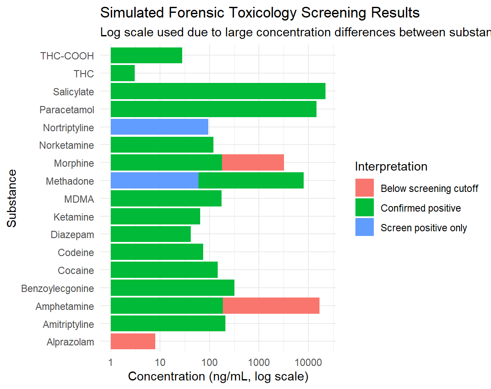

# Project 1: Forensic Toxicology Drug Screening

## Aim

This project simulates a forensic toxicology screening workflow in which sample drug concentrations are compared against analytical detection thresholds.

The aim is to demonstrate how toxicology results can be organised, analysed, visualised, and interpreted in a forensic context.

## Background

Forensic toxicology involves detecting and interpreting drugs, alcohol, poisons, and other substances in biological samples. In a laboratory setting, analytical results must be interpreted carefully because detection does not always imply impairment, toxicity, or cause of death. Interpretation depends on concentration, sample type, timing, analytical method, and case context.

## Dataset

This project uses a simulated dataset containing:

* Sample ID
* Substance detected
* Measured concentration
* Detection threshold
* Interpretation category

## Methods

The analysis will:

1. Import the toxicology dataset
2. Compare measured concentration against detection threshold
3. Categorise each result as not detected, detected, or above reporting threshold
4. Visualise concentration patterns
5. Produce a short forensic-style interpretation

## Results

Twenty simulated toxicology samples were analysed and classified according to analytical screening and confirmation thresholds.

| Interpretation         | Count |
| ---------------------- | ----: |
| Confirmed Positive     |    15 |
| Screen Positive Only   |     2 |
| Below Screening Cutoff |     3 |

The majority of samples exceeded confirmation thresholds and were classified as confirmed positive.

### Toxicology Screening Visualisation

The visualisation demonstrates substantial variation in measured concentrations between substances. A logarithmic scale was used to account for large differences in concentration magnitude, particularly for paracetamol and salicylate.

## Discussion

Most samples were classified as confirmed positive, indicating concentrations above analytical confirmation thresholds. Only a small number of samples were classified as screen positive only or below screening cutoff.

This project demonstrates a basic forensic toxicology workflow involving data import, threshold-based classification, visualisation, and interpretation using R. The use of a log-transformed scale highlights how analytical data can span several orders of magnitude and require appropriate visualisation techniques for meaningful comparison.

The project also demonstrates reproducible data analysis practices by providing the original dataset, analysis script, and visual outputs.

## Files

* `toxicology_screening_data.csv` – simulated toxicology dataset
* `toxicology_screening_analysis.R` – analysis workflow and visualisation code
* `toxicology_screening_plot.png` – final visualisation

## Skills Demonstrated

* Data organisation
* Threshold-based analysis
* Data visualisation
* Scientific interpretation
* Forensic toxicology reasoning

## Limitations

This is a simulated dataset and should not be used for real forensic or clinical interpretation. Real toxicology interpretation requires validated analytical methods, quality controls, chain-of-custody procedures, and case-specific information.
